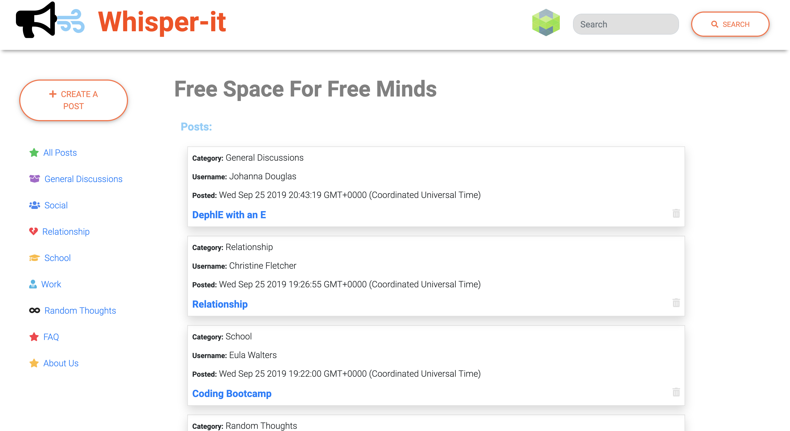

# whisper-it

**Whisper-it** is an anonymous forum with MySQL, Node, Express, Handlebars and sequelize that follows MVC design pattern.

## Getting Started

- Clone down repo.
- Node.js - Download the latest version of Node https://nodejs.org/en/
- Run command 'npm install' in Terminal or GitBash to install npm package dependencies needed for this app.
- create .env file and store your MySQL password for the localhost as MYSQLPASS=yourmysqllocalhostserverpassword.
- Run the schemal.sql in the MySQL workbench to create a database.

## Deployed Website
**Whisper-it** is deployed to Heroku. [Here](https://whisper-it.herokuapp.com/) is the link to the deployed site.

## How to Use
To use our forum, go to our [Website](https://whisper-it.herokuapp.com/).
**To create a post:** 
  - Click `create a post` button.
  - Fill out the form with category, pin number for the post, title of the post, and content of the post. The username will be randomly generated for the users each time they make a post to stay anonymous
  - Click `submit post` button and the user will be redirected to the index page and the user's post is created.
**To view the post**
  - Click on the title of the post you want to see. It will redirect to the post page with it's content.
**To create a comment(reply) on a post**
  - Click on the title of the post to go to the post page.
  - Fill out the reply to post form.
  - Click submit button
**To remove a post or comment**
  - Click on the trash icon located at the bottom right corner of a post or comment you created.
  - Fill out the form (requires pin number user inputted when making a post or comment)
  - CLick on the delete post(comment) button.
**To view only the post in certain categories**
  - Click on the category link on the left side of the forum.
  - Only the posts with the category of your choice will be displayed.

### Homepage

## Tech used
- Bootstrap
- Material-Design
- Handlebars
- JavaScript
- JQuery
- Node.js
- Sequelize
- MySQL
- Express - https://expressjs.com/
- Express NPM Package- https://www.npmjs.com/package/express
- Heroku - https://www.heroku.com
- Chance.JS - https://chancejs.com/index.html
- TravisCI - https://travis-ci.org/
- Hashicon - https://www.npmjs.com/package/hashicon
- .gitignore - to tell git not to track files such as node_modules and mysql password thus they won't be committed to Github.

## Authors

* **Youngwoo Cho** - *Node JS / Express / MySQL / Handlebars / Sequelize* - [Youngwoo Cho](https://github.com/catnap89)
* **Trey Helmer** - *Bootstrap / Material-Design/ Jquery* - [Trey Helmer](https://github.com/PCHIII)
* **Michael Passow** - *Bootstrap / Material-Design/ Hashicon* - [Michael Passow](https://github.com/mikepassow)
* **Tina Azad** - *Bootstrap / Material-Design* - [Tina Azad](https://github.com/RajTina)